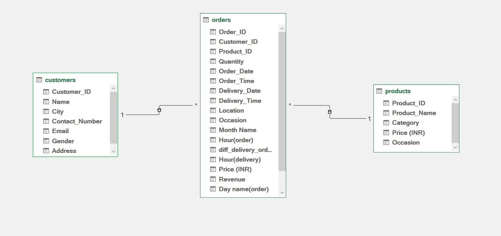
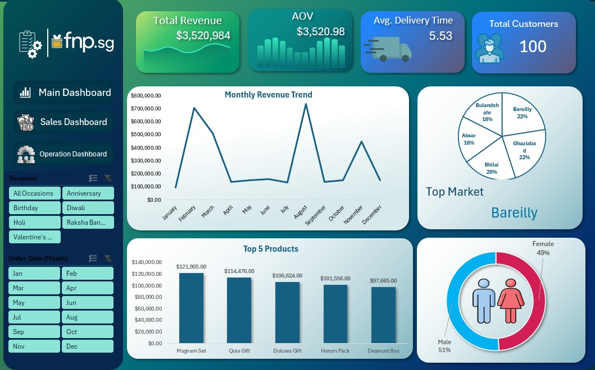
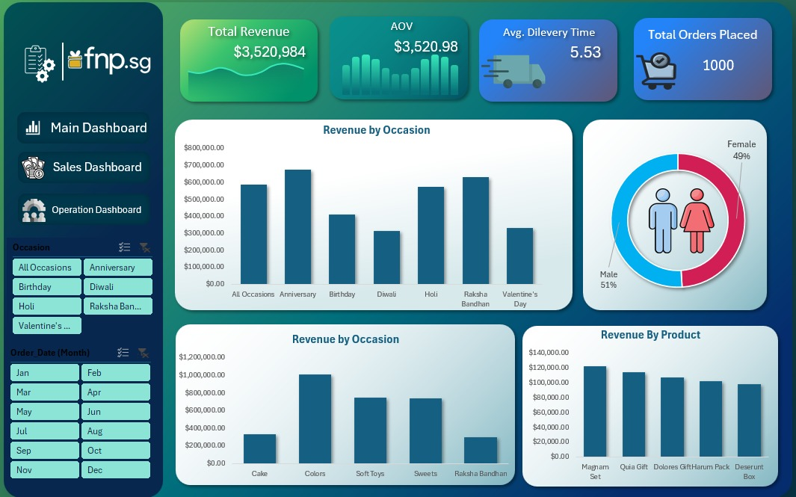
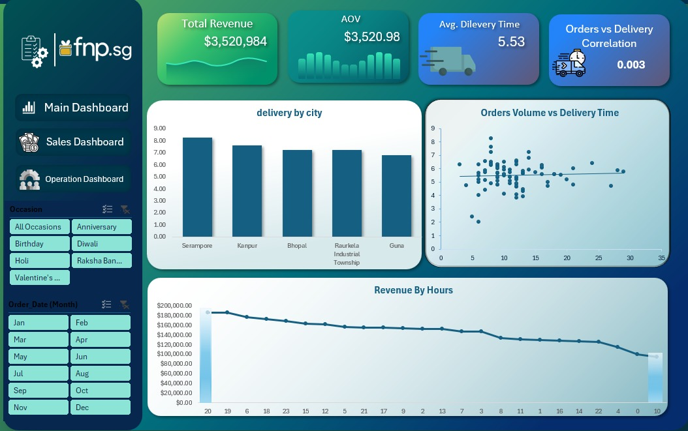

# Ferns N Petals Sales Analysis Dashboard

## Project Overview
This project analyzes sales and operational performance for **Ferns N Petals (FnP)** using Excel.

The workflow covered the full analytics lifecycle:

- Data Cleaning
- Data Transformation using Power Query
- Star Schema Data Modeling using Power Pivot
- KPI Analysis with Pivot Tables
- Interactive Dashboard Development

The final output is an interactive **3-page Excel dashboard** built for business decision-making.

---

## Dataset
The project is built using 3 datasets:

| File | Description |
|---|---|
| customers.csv | Customer information |
| orders.csv | Sales transactions |
| products.csv | Product details |

### Dataset Summary
- **100 Customers**
- **1,000 Orders**
- **70 Products**

---

## Data Model

A **Star Schema** was implemented for efficient analysis.

### Fact Table
- Orders

### Dimension Tables
- Customers
- Products

Power Pivot relationships were used to connect dimension tables with the central fact table.

## Data Model Preview


---

## Dashboard Structure

The dashboard consists of 3 interactive pages:

### 1. Main Dashboard
Provides a high-level executive overview.

Includes:
- Total Revenue
- Average Order Value
- Total Orders
- Delivery KPIs
- Revenue Trend Analysis

#### Preview


---

### 2. Sales Dashboard
Focused on revenue and customer behavior analysis.

Includes:
- Monthly Revenue Trends
- Occasion-wise Sales
- Product Performance
- City-wise Distribution
- Customer Insights

#### Preview


---

### 3. Operations Dashboard
Focused on logistics and operational efficiency.

Includes:
- Delivery Delay Analysis
- Average Delivery Time
- Order Processing Trends
- Operational KPIs

#### Preview


---

## Key KPIs

| KPI | Value |
|---|---|
| Total Revenue | ₹35.2L |
| Average Order Value | ₹3,520 |
| Average Delivery Time | 5.53 Days |

---

## Key Insights
- Revenue peaks significantly in **August** during **Raksha Bandhan**
- Festival seasons strongly impact customer purchasing behavior
- **Soft Toys** and **Magnam Sets** are top-performing products
- Order quantity has minimal effect on delivery speed (**Correlation ≈ 0.05**)

---

## Tools Used
- Microsoft Excel
- Power Query
- Power Pivot
- Pivot Tables
- Dashboard Design

---

## Project Folder Structure

```bash
FnP-Sales-Analysis/
│
├── data/
│   ├── customers.csv
│   ├── orders.csv
│   └── products.csv
│
├── dashboard/
│   └── FnP_Sales_Analysis.xlsx
│
├── images/
│   ├── data-model.png
│   ├── main-dashboard.png
│   ├── sales-dashboard.png
│   └── operations-dashboard.png
│
├── presentation/
│   └── FnP_Sales_Analysis_Presentation.pptx
│
└── README.md
```

---

## Business Recommendations
- Optimize inventory before peak festival seasons
- Prioritize top-performing products before high-demand months
- Closely monitor delivery efficiency during seasonal spikes

---

## Author
**Mahmoud Saad**

Connect with me on LinkedIn and feel free to explore the project.
